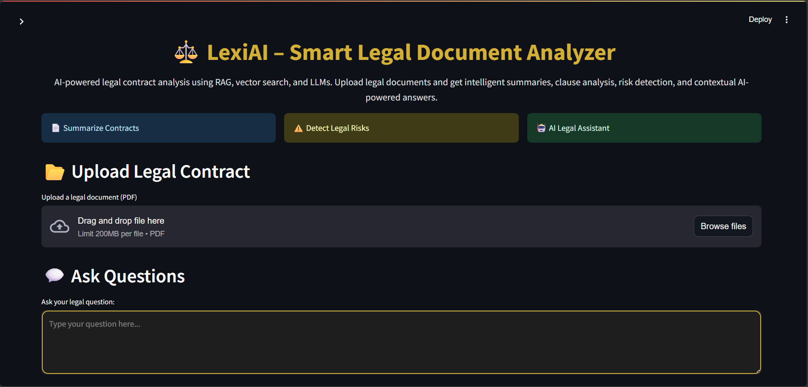
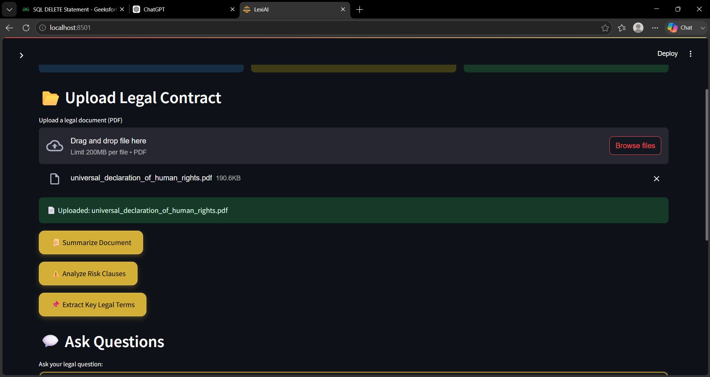
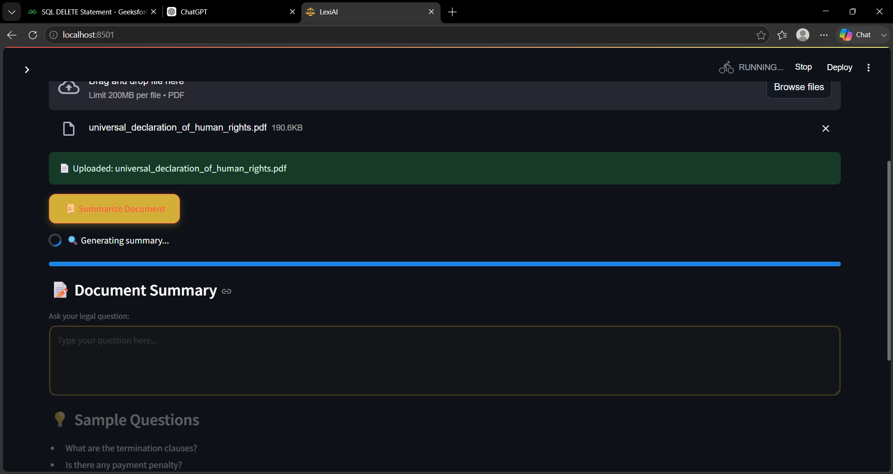
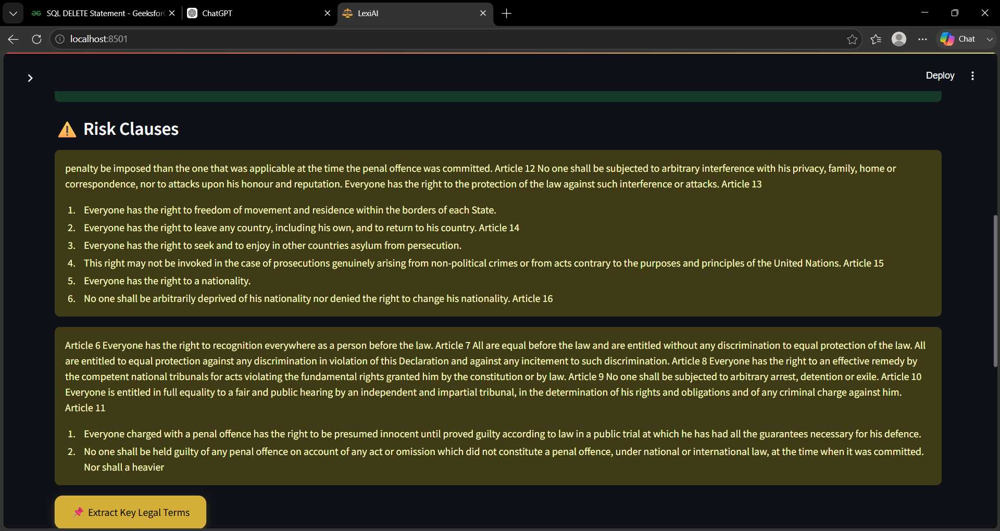

# ⚖️ LexiAI - AI Legal Assistant

LexiAI is an AI-powered legal assistant that helps users understand legal documents through Retrieval-Augmented Generation (RAG). Users can upload legal PDFs and ask questions in natural language to receive context-aware answers.

---

## 🚀 Features

- 📄 Upload legal PDF documents
- 🤖 AI-powered legal question answering
- 🔍 Semantic search using FAISS
- 🧠 Retrieval-Augmented Generation (RAG)
- 💬 Conversational chatbot interface
- ⚡ Fast document retrieval
- 🎨 Interactive Streamlit UI

---

## 🛠 Tech Stack

### Frontend
- Streamlit

### Backend
- Python

### AI & Machine Learning
- LangChain
- Groq LLM
- HuggingFace Embeddings
- FAISS

### Libraries
- PyPDF
- Sentence Transformers
- python-dotenv

---

## 📂 Project Structure

```
LexiAI/
│
├── frontend.py
├── main.py
├── rag_pipeline.py
├── vector_database.py
├── requirements.txt
├── pdfs/
├── utils/
├── vectorstore/
└── README.md
```

---

## ⚙ Installation

### Clone Repository

```bash
git clone https://github.com/Neha21-d/LexiAI.git
```

### Move into Project

```bash
cd LexiAI
```

### Install Dependencies

```bash
pip install -r requirements.txt
```

### Create .env

```env
GROQ_API_KEY=your_api_key_here
```

### Run

```bash
streamlit run frontend.py
```

---

## 📸 Screenshots

### Home Page


### Documentupload


### Chat Interface




---

## 🎯 Future Enhancements

- Voice-based interaction
- Multi-language legal assistance
- OCR support for scanned PDFs
- Chat history
- Cloud deployment
- User authentication

---

## 👩‍💻 Author

**Neha**

GitHub: https://github.com/Neha21-d
